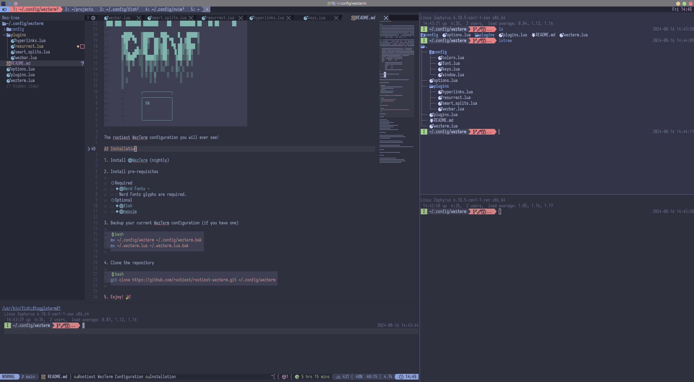

# Rootiest WezTerm Configuration

```none
 ██▀███   ▒█████   ▒█████  ▄▄▄█████▓ ██▓▓█████   ██████ ▄▄▄█████▓
▓██ ▒ ██▒▒██▒  ██▒▒██▒  ██▒▓  ██▒ ▓▒▓██▒▓█   ▀ ▒██    ▒ ▓  ██▒ ▓▒
▓██ ░▄█ ▒▒██░  ██▒▒██░  ██▒▒ ▓██░ ▒░▒██▒▒███   ░ ▓██▄   ▒ ▓██░ ▒░
▒██▀▀█▄  ▒██   ██░▒██   ██░░ ▓██▓ ░ ░██░▒▓█  ▄   ▒   ██▒░ ▓██▓ ░
░██▓ ▒██▒░ ████▓▒░░ ████▓▒░  ▒██▒ ░ ░██░░▒████▒▒██████▒▒  ▒██▒ ░
░ ▒▓ ░▒▓░░ ▒░▒░▒░ ░ ▒░▒░▒░   ▒ ░░   ░▓  ░░ ▒░ ░▒ ▒▓▒ ▒ ░  ▒ ░░
  ░▒ ░ ▒░  ░ ▒ ▒░   ░ ▒ ▒░     ░     ▒ ░ ░ ░  ░░ ░▒  ░ ░    ░
  ░░   ░ ░ ░ ░ ▒  ░ ░ ░ ▒    ░       ▒ ░   ░   ░  ░  ░    ░
   ░         ░ ░      ░ ░            ░     ░  ░      ░

 ██     ██ ███████ ███████ ████████ ███████ ██████  ███    ███
 ██     ██ ██         ███     ██    ██      ██   ██ ████  ████
 ██  █  ██ █████     ███      ██    █████   ██████  ██ ████ ██
 ██ ███ ██ ██       ███       ██    ██      ██   ██ ██  ██  ██
  ███ ███  ███████ ███████    ██    ███████ ██   ██ ██      ██

        ▄████▄   ▒█████   ███▄    █   █████▒
        ▒██▀ ▀█  ▒██▒  ██▒ ██ ▀█   █ ▓██   ▒
        ▒▓█    ▄ ▒██░  ██▒▓██  ▀█ ██▒▒████ ░
        ▒▓▓▄ ▄██▒▒██   ██░▓██▒  ▐▌██▒░▓█▒  ░
        ▒ ▓███▀ ░░ ████▓▒░▒██░   ▓██░░▒█░
        ░ ░▒ ▒  ░░ ▒░▒░▒░ ░ ▒░   ▒ ▒  ▒ ░
        ░  ▒     ░ ▒ ▒░ ░ ░░   ░ ▒░ ░
        ░        ░ ░ ░ ▒     ░   ░ ░  ░ ░
        ░ ░          ░ ░           ░
        ░
                 ╭─────────────╮
                 ╭─────────────╮
                 │ $W          │
                 │             │
                 │             │
                 ╰─────────────╯
```

The rootiest WezTerm configuration you will ever see!

## Installation

1. Install [WezTerm](https://wezfurlong.org/wezterm/installation.html) (nightly)

2. Install pre-requisites

   - Required
     - [Rootiest Iosevka fonts](./fonts/README.md).
   - Optional
     - [fish](https://fishshell.com/)
     - [neovim](https://neovim.io/)

3. Backup your current WezTerm configuration (if you have one)

   ```bash
   mv ~/.config/wezterm ~/.config/wezterm.bak
   mv ~/.wezterm.lua ~/.wezterm.lua.bak
   ```

4. Clone the repository

   ```bash
   git clone https://github.com/rootiest/rootiest-wezterm.git ~/.config/wezterm
   ```

5. **Enjoy!** 🎉

### Windows Users

1. Install [PowerShell](https://docs.microsoft.com/en-us/powershell/scripting/install/installing-powershell?view=powershell-7.1)

2. Install [Rootiest Iosevka fonts](./fonts/README.md#windows)

3. Install [WezTerm](https://wezfurlong.org/wezterm/installation.html)

4. Clone the repository

   ```powershell
   $home = $env:USERPROFILE
   git clone https://github.com/rootiest/rootiest-wezterm.git $home/.config/wezterm
   ```

5. Enjoy! 🎉

## Features

- Smart key bindings
- Leader key and modal mode
- Session mux/management/resurrection
- Advanced tab management
- Splits and panes integrate seamlessly with NeoVim
- Seamless integration with fish shell
- Catppuccin theme by default
- Integrates cleanly with other Rootiest projects

## Customization

User customizations can be added by creating a `user.lua` file in the
`~/.config/wezterm` directory.

### General Configuration

The file should be structured in the following manner:

```lua
return {
  -- Ex:
  color_scheme = "Catppuccin Mocha",
  leader = { key = "a", mods = "CTRL", timeout_milliseconds = 1000 },
  default_prog = { "/bin/zsh", "-l" },
}
```

Config options can be found in the
[wezterm Configuration documentation](https://wezfurlong.org/wezterm/config/files.html).

Options in the `user.lua` file are written as
`key = value` pairs (without the `config.` prefix).

The configuration loading code will detect the user file
and merge it with the rest of the configuration.

This is applied after the default config so user options will override any defaults.

Further, the `user.lua` file is ignored by git and
will not impact your ability to pull updates.

### Session Encryption

The default configuration attempts to use my personal encryption keys.

If the keyfile cannot be found, encryption is disabled.

You can customize this by adding (above the `return{}` table):

```lua
MYKEY = "/path/to/keyfile.txt" -- Path to the keyfile
MYPUBKEY = "age1q80h5jsp9d48kggf9kra82xkgyaqdnehqenm003ftapem9re7ytqp9hr6h"

return {
  -- Etc..
}
```

These global variables will be detected and used to apply the encryption.

As with the default configuration, if the keyfile is not found, encryption is disabled.

### Tabline Customization

The tabline configuration can also be customized.

This is done by adding (above the `return{}` table):

```lua
local wezterm = WEZTERM -- Link to the main wezterm object

MYTABLINE = {
  options = {
    icons_enabled = true,
    theme = 'Catppuccin Mocha',
    color_overrides = {},
    section_separators = {
      left = wezterm.nerdfonts.pl_left_hard_divider,
      right = wezterm.nerdfonts.pl_right_hard_divider,
    },
    component_separators = {
      left = wezterm.nerdfonts.pl_left_soft_divider,
      right = wezterm.nerdfonts.pl_right_soft_divider,
    },
    tab_separators = {
      left = wezterm.nerdfonts.pl_left_hard_divider,
      right = wezterm.nerdfonts.pl_right_hard_divider,
    },
  },
  sections = {
    tabline_a = { 'mode' },
    tabline_b = { 'workspace' },
    tabline_c = { ' ' },
    tab_active = {
      'index',
      { 'parent', padding = 0 },
      '/',
      { 'cwd', padding = { left = 0, right = 1 } },
      { 'zoomed', padding = 0 },
    },
    tab_inactive = { 'index', { 'process', padding = { left = 0, right = 1 } } },
    tabline_x = { 'ram', 'cpu' },
    tabline_y = { 'datetime', 'battery' },
    tabline_z = { 'hostname' },
  },
  extensions = {},
}

return {
  -- Etc..
}
```

The table above is taken from the example in the
[tabline.wez documentation](https://github.com/michaelbrusegard/tabline.wez?tab=readme-ov-file#default-configuration).

This is the table that will be passed to `tabline.setup()`
and loaded by the tabline plugin.

## Screenshots



## Companion Tools

[Rootiest Fish Conf](https://github.com/rootiest/rootiest-fish) -
Fish shell configuration that pairs well with this WezTerm configuration
and the NeoVim configuration.

[Rootiest Neovim](https://github.com/rootiest/rootiest-nvim) -
A NeoVim config built to work alongside this and the fish config.

[Nerd Fonts](https://github.com/ryanoasis/nerd-fonts/) -
A collection of fonts that include many icons and glyphs that are used in this configuration.

## Dotfiles

[Rootiest Dotfiles](https://github.com/rootiest/dotfiles)

## Credits

- [wezterm](https://github.com/wez/wezterm)
- [resurrect.wezterm](https://github.com/MLFlexer/resurrect.wezterm)
- [smart-splits.nvim](https://github.com/mrjones2014/smart-splits.nvim)
- [wezterm-bar](https://github.com/nekowinston/wezterm-bar)
