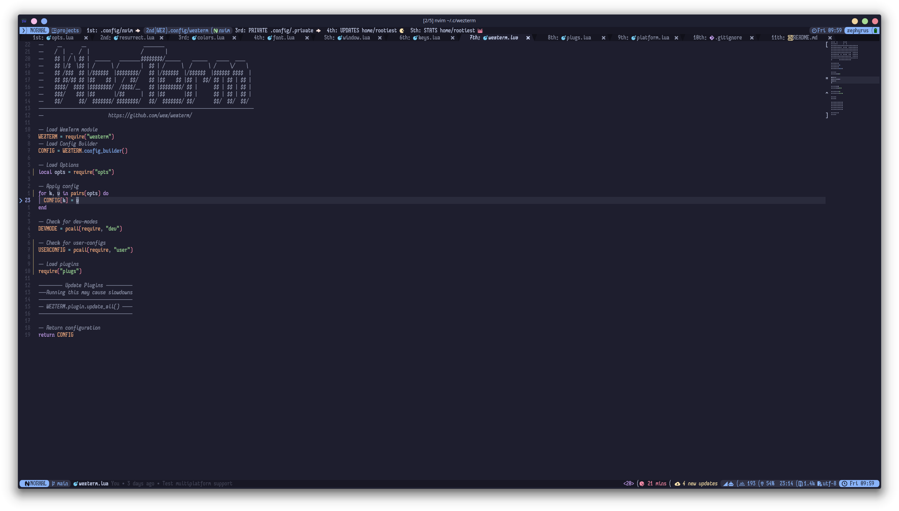

# Rootiest WezTerm Configuration

```none
 ██▀███   ▒█████   ▒█████  ▄▄▄█████▓ ██▓▓█████   ██████ ▄▄▄█████▓
▓██ ▒ ██▒▒██▒  ██▒▒██▒  ██▒▓  ██▒ ▓▒▓██▒▓█   ▀ ▒██    ▒ ▓  ██▒ ▓▒
▓██ ░▄█ ▒▒██░  ██▒▒██░  ██▒▒ ▓██░ ▒░▒██▒▒███   ░ ▓██▄   ▒ ▓██░ ▒░
▒██▀▀█▄  ▒██   ██░▒██   ██░░ ▓██▓ ░ ░██░▒▓█  ▄   ▒   ██▒░ ▓██▓ ░
░██▓ ▒██▒░ ████▓▒░░ ████▓▒░  ▒██▒ ░ ░██░░▒████▒▒██████▒▒  ▒██▒ ░
░ ▒▓ ░▒▓░░ ▒░▒░▒░ ░ ▒░▒░▒░   ▒ ░░   ░▓  ░░ ▒░ ░▒ ▒▓▒ ▒ ░  ▒ ░░
  ░▒ ░ ▒░  ░ ▒ ▒░   ░ ▒ ▒░     ░     ▒ ░ ░ ░  ░░ ░▒  ░ ░    ░
  ░░   ░ ░ ░ ░ ▒  ░ ░ ░ ▒    ░       ▒ ░   ░   ░  ░  ░    ░
   ░         ░ ░      ░ ░            ░     ░  ░      ░

██     ██ ███████ ███████ ████████ ███████ ██████  ███    ███ 
██     ██ ██         ███     ██    ██      ██   ██ ████  ████ 
██  █  ██ █████     ███      ██    █████   ██████  ██ ████ ██ 
██ ███ ██ ██       ███       ██    ██      ██   ██ ██  ██  ██ 
 ███ ███  ███████ ███████    ██    ███████ ██   ██ ██      ██ 

        ▄████▄   ▒█████   ███▄    █   █████▒
        ▒██▀ ▀█  ▒██▒  ██▒ ██ ▀█   █ ▓██   ▒
        ▒▓█    ▄ ▒██░  ██▒▓██  ▀█ ██▒▒████ ░
        ▒▓▓▄ ▄██▒▒██   ██░▓██▒  ▐▌██▒░▓█▒  ░
        ▒ ▓███▀ ░░ ████▓▒░▒██░   ▓██░░▒█░
        ░ ░▒ ▒  ░░ ▒░▒░▒░ ░ ▒░   ▒ ▒  ▒ ░
        ░  ▒     ░ ▒ ▒░ ░ ░░   ░ ▒░ ░
        ░        ░ ░ ░ ▒     ░   ░ ░  ░ ░
        ░ ░          ░ ░           ░
        ░
                 ╭─────────────╮
                 ╭─────────────╮
                 │ $W          │
                 │             │
                 │             │
                 ╰─────────────╯
```

The rootiest WezTerm configuration you will ever see!

## Installation

1. Install [WezTerm](https://wezfurlong.org/wezterm/installation.html) (nightly)

2. Install pre-requisites

   - Required
     - [Nerd Fonts](https://github.com/ryanoasis/nerd-fonts/) -
       Nerd Fonts glyphs are required.
   - Optional
     - [fish](https://fishshell.com/)
     - [neovim](https://neovim.io/)

3. Backup your current WezTerm configuration (if you have one)

   ```bash
   mv ~/.config/wezterm ~/.config/wezterm.bak
   mv ~/.wezterm.lua ~/.wezterm.lua.bak
   ```

4. Clone the repository

   ```bash
   git clone https://github.com/rootiest/rootiest-wezterm.git ~/.config/wezterm
   ```

5. **Enjoy!** 🎉

## Features

- Smart key bindings
- Leader key and modal mode
- Session mux/management/resurrection
- Advanced tab management
- Splits and panes integrate seamlessly with NeoVim
- Seamless integration with fish shell
- Catppuccin theme by default
- Integrates cleanly with other Rootiest projects

## Screenshots



## Companion Tools

[Rootiest Fish Conf](https://github.com/rootiest/rootiest-fish) -
Fish shell configuration that pairs well with this WezTerm configuration
and the NeoVim configuration.

[Rootiest Neovim](https://github.com/rootiest/rootiest-nvim) -
A NeoVim config built to work alongside this and the fish config.

[Nerd Fonts](https://github.com/ryanoasis/nerd-fonts/) -
A collection of fonts that include many icons and glyphs that are used in this configuration.

## Dotfiles

[Rootiest Dotfiles](https://github.com/rootiest/dotfiles)

## Credits

- [wezterm](https://github.com/wez/wezterm)
- [resurrect.wezterm](https://github.com/MLFlexer/resurrect.wezterm)
- [smart-splits.nvim](https://github.com/mrjones2014/smart-splits.nvim)
- [wezterm-bar](https://github.com/nekowinston/wezterm-bar)
